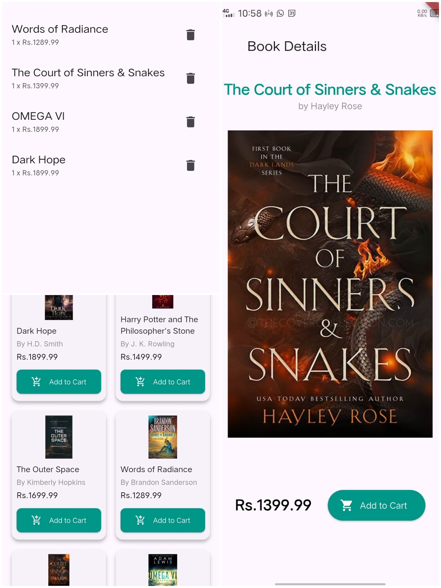

**#Book Store App**

## Overview ##

This is a simple book store app built with `Flutter`, showcasing `state management`, `reusable components`, and a clean app structure.

## Features ##

Grid View of Books: Displays books in a visually appealing grid layout.

Add to Cart: Allows users to add books to their shopping cart.

Cart Management:

> Manage item quantities.

> Remove items from the cart.

> Calculate total price.

## App Structure ##

<!-- Models -->

`Book` Represents a book with the following attributes:

> Title

> Author

> Price

`CartItem` Represents an item in the cart with:

    Quantity

<!-- Providers -->

`CartProvider` Manages the state of the shopping cart using the Provider package.

<!-- Widgets -->

`BookCard` A reusable widget for displaying book information.

<!-- Screens -->

> HomeScreen: Displays a grid of available books.

> CartScreen: Shows the items in the cart and the total price.

## How to Run ##

Ensure all required dependencies are installed.

Run the following commands:
#
    flutter pub get

    flutter run
#
<!-- Best Practices Followed -->

Separation of Concerns: Logical division of app functionality.

Reusable Components: Components like BookCard can be used across the app.

State Management: Efficiently managed with the Provider package.

Clean File Structure: Organized and easy to navigate.